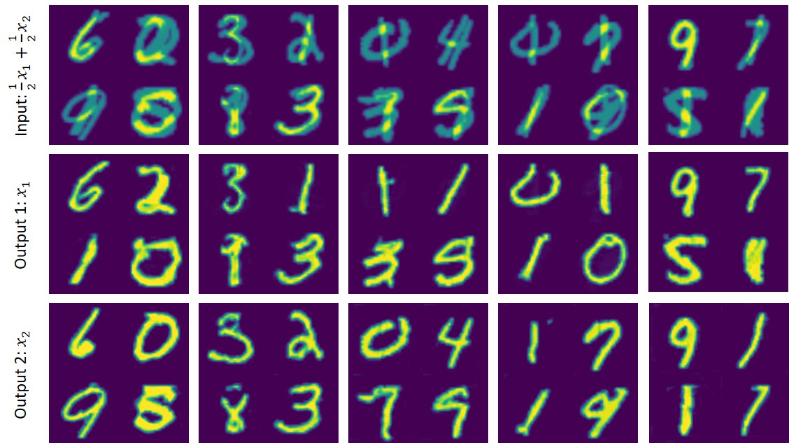
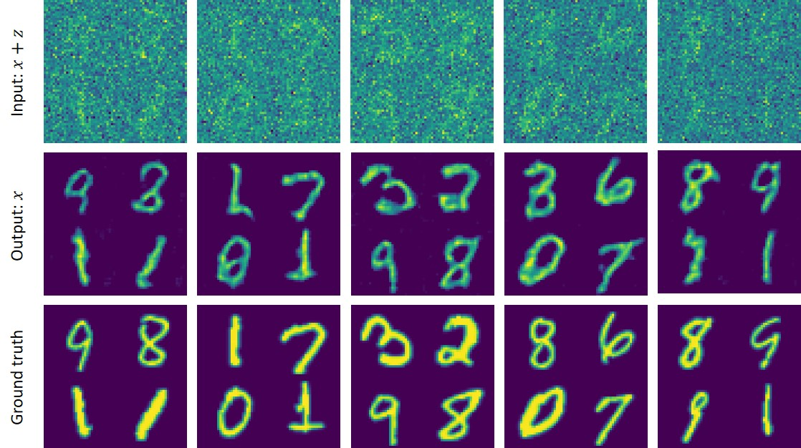

# GANs for Solving Inverse Problems
Tensorflow implementation for: "Adversarial Training for Solving Inverse Problems". 

Inverse problems are a group of important mathematical problems that aim at estimating source data x and operation parameters z from inadequate observations y. In the image processing field, most recent deep learning-based methods simply deal with such problems under a pixel-wise regression framework (from y to x) while ignoring the physics behind. In this paper, we re-examine these problems under a different viewpoint and propose a novel framework for solving certain types of inverse problems in the image processing field. Instead of predicting x directly from y, we train a deep neural network to estimate the parameters z under an adversarial training paradigm so that to shed light on the causal relationship behind. We show that in an inverse problem, if the degradation behind satisfies some typical assumptions, the solution to the problem can be greatly improved by introducing additional adversarial constraints to the parameter space and the training may not even require pair-wise supervision. In our experiment, we apply our method to a wide variety of real-world problems, such as image denoising, image deraining, non-uniform illumination correction, underdetermined blind source separation of images or speech signals, etc. The results on multiple tasks demonstrate the superiority of our method.

With this project, you can train a model to solve the following inverse problems:
- Separating superimposed images on MNIST and CIFAR-10 datasets.
- Image denoising on MNIST
- Removing speckle and streak noise in CAPTCHAs

All the above tasks can be trained w/ or w/o the help of pair-wise supervision. For more information of this project, please refer to our paper.


## Prerequisites

- python 3.5
- anaconda>=5.2
- opencv>=3.4
- tensorflow >=1.8


## Usage

Train:

```
python igan.py
```

Test:

```
python deploy.py 
```

Configurations:

```
vi initializer.py 
```

## Results

#### A toy data

An illustration of the training process of our method on two groups of 2D data: 1) Gaussian data, and 2) Banana data. Our method aims to learn an invertible mapping (Affine transformation) for each data point so that to map green cluster to the red and inversely map the red to the green.  No pair-wise supervision is provided during the training.


#### Separating superimposed images

Some example results of superimposed image separation by using our method on MNIST and CIFAR-10 datasets. No pair-wise supervision is used during the training.





#### Breaking CAPTCHAs

Some example results of undetermined BBS for CAPTCHA images by using our method. No pair-wise supervision is used during the training.


Some example results of undetermined BSS for speech signals by using our method. Each audio CAPTCHA fragment consists of 4 random pieces of the human voice and is about 2.5 seconds long (8kHz). No pair-wise supervision is used during the training.


#### Denoising

Some example results of image denoising on MNIST images. Despite the strong noise (PSNR less than 0.01 dB), our method sill nicely recovers the clear image. No pair-wise supervision is used during the training.




#### Deraining

Some example results of image deraining with different methods on the [Image Deraining Dataset](https://arxiv.org/abs/1701.05957): [CycleGAN](https://github.com/junyanz/CycleGAN), and [Pixel-to-Pixel](https://github.com/phillipi/pix2pix) and Ours.


