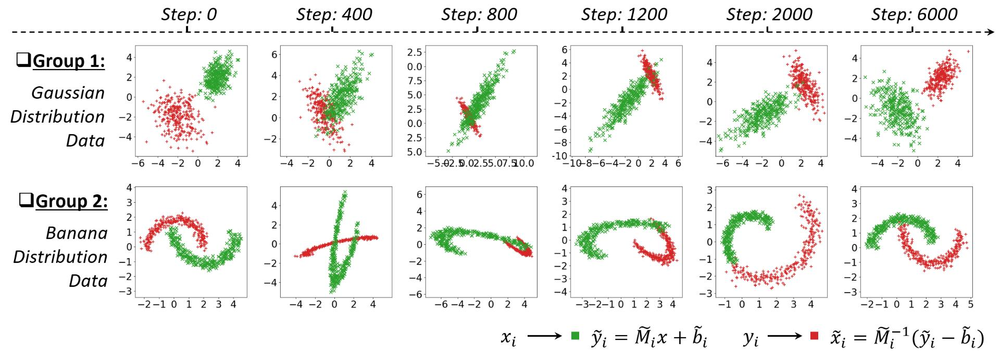
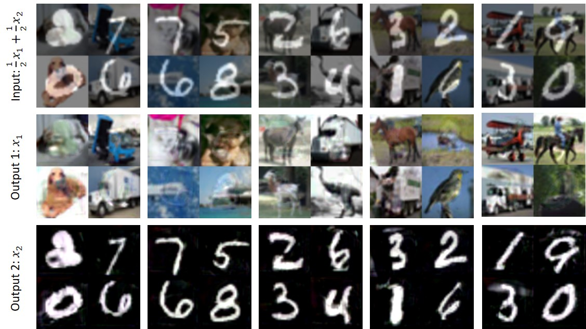
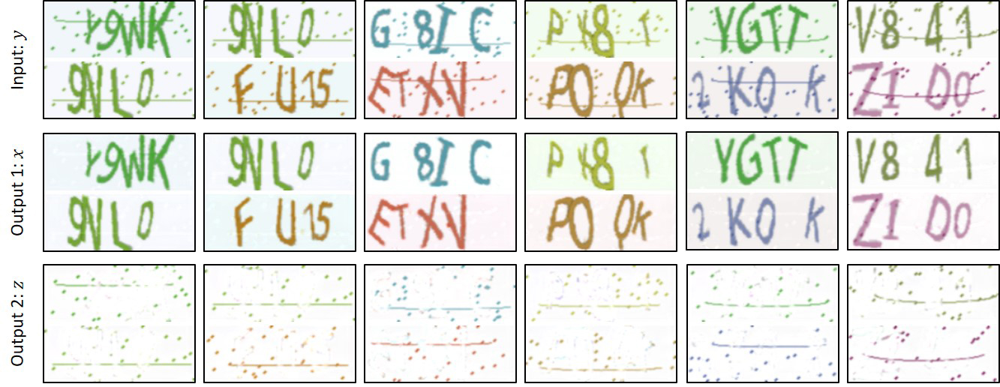

# GANs for Solving Inverse Problems
The test code for: "Adversarial Training for Solving Inverse Problems".

Author: zzhengxi@umich.edu

With this project, you can train a model to solve the following inverse problems:
- Separating superimposed images on MNIST and CIFAR-10 datasets.
- Image denoising on MNIST
- Removing speckle and streak noise in CAPTCHAs

All the above tasks are trained without any help of pair-wise supervision.

## Prerequisites

- python 3.5
- anaconda>=5.2
- opencv>=3.4
- tensorflow >=1.8

## Usage

Train:

    $ python igan.py

Test:

    $ python deploy.py 

Configurations:

    $ vi initializer.py 

## Results

#### A toy data

An illustration of the training process of our method on two groups of 2D data: 1) Gaussian data, and 2) Banana data. Our method aims to learn an invertible mapping (Affine transformation) for each data point so that to map green cluster to the red and inversely map the red to the green.  No pair-wise supervision is provided during the training.

#### Separating superimposed images

Some example results of superimposed image separation by using our method on MNIST and CIFAR-10 datasets. No pair-wise supervision is used during the training.

#### Breaking CAPTCHAs

Some example results of undetermined BBS for CAPTCHA images by using our method. No pair-wise supervision is used during the training.

Some example results of undetermined BSS for speech signals by using our method. Each audio CAPTCHA fragment consists of 4 random pieces of the human voice and is about 2.5 seconds long (8kHz). No pair-wise supervision is used during the training.

#### Denoising

Some example results of image denoising on MNIST images. Despite the strong noise (PSNR less than 0.01 dB), our method sill nicely recovers the clear image. No pair-wise supervision is used during the training.

#### Deraining

Some example results of image deraining with different methods on the [Image Deraining Dataset](https://arxiv.org/abs/1701.05957): [CycleGAN](https://github.com/junyanz/CycleGAN), and [Pixel-to-Pixel](https://github.com/phillipi/pix2pix) and Ours.

